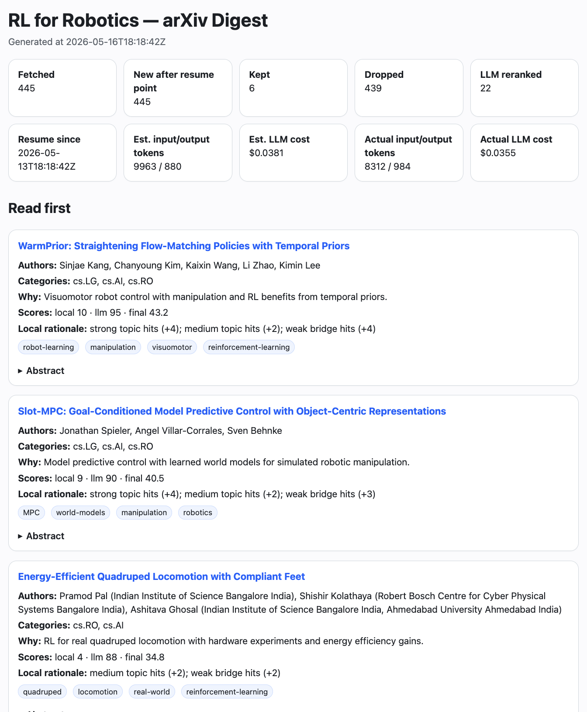

# Arxiv-digest

`arxiv-digest` is a small research tool for researchers who want to keep reading new arXiv papers without manually sorting through the daily volume of submissions.

The user defines a research topic in `config.toml`: arXiv categories, positive keywords, negative keywords, optional author preferences, and an optional LLM instruction. The program retrieves recent arXiv records, computes an explicit relevance score for each paper, and writes a local HTML report ordered for reading.

The project is designed for topics that are distributed across several arXiv categories and cannot be captured by one keyword query. For example, reinforcement learning in robotics may appear under robotics, machine learning, or artificial intelligence, and relevant abstracts may use terms such as `robot learning`, `robot control`, `policy learning`, `legged locomotion`, or `dexterous manipulation`.

The scoring has two stages. First, the program applies a keyword-and-author rule defined in `config.toml`. This produces a local score that can be checked directly in the report. Second, if the LLM stage is enabled, the program asks the LLM model to read selected titles and abstracts and to assign an additional relevance score for the same research topic.

The main output is:

```text
output/latest.html
```

The report contains paper titles, authors, categories, abstracts, scores, reasons, and tags.



The screenshot shows a configuration for reinforcement learning in robotics. Other topics only require editing `config.toml`.

## Method

The program uses two scoring stages.

### 1. Local score

The local score is deterministic. It is computed from the paper title, abstract, author list, and arXiv categories.

The user defines four keyword lists in `config.toml`:

```toml
positive_keywords_strong = ["robot learning", "reinforcement learning for robotics"]
positive_keywords_medium = ["imitation learning", "visuomotor policy"]
positive_keywords_weak = ["robot", "policy", "control"]
negative_keywords = ["speech recognition", "text-to-image"]
```

The program counts how many terms from each list are found in the paper title or abstract:

```text
strong_keyword_matches   = number of strong keywords found
medium_keyword_matches   = number of medium keywords found
weak_keyword_matches     = number of weak keywords found
negative_keyword_matches = number of negative keywords found
```

The user may also define author lists:

```toml
preferred_authors = ["Jane Example"]
blocked_authors_exact = ["John Example"]
```

The program counts preferred author matches in the author list:

```text
preferred_author_matches = number of preferred authors found
```

If a blocked author is found, the paper is assigned a very low score and is dropped:

```text
local_score = -999
```

Otherwise, the local score is computed as:

```text
local_score =
    6 * preferred_author_matches
  + 4 * strong_keyword_matches
  + 2 * medium_keyword_matches
  + min(weak_keyword_matches, 4)
  - 4 * negative_keyword_matches
  + category_adjustment
```

The weights have the following meaning:

```text
preferred author match -> strong positive signal
strong keyword match   -> strong topical signal
medium keyword match   -> moderate topical signal
weak keyword match     -> weak topical signal, capped at 4 points
negative keyword match -> evidence against the topic
category adjustment    -> small fixed adjustment from arXiv categories
```

The weak-keyword cap prevents broad words such as `robot`, `policy`, or `control` from dominating the score.

The local stage keeps a paper when:

```text
local_score >= local_keep_threshold
```

For example:

```toml
local_keep_threshold = 6
```

means that papers with local score `6` or higher are kept when the LLM stage is disabled.

### 2. Optional LLM score

The LLM stage is used only when `enabled = true` in `[llm]`.

When enabled, the program sends selected paper records to the model. Each record contains the title, abstract, authors, categories, local score, and local reason.

For each paper, the model returns:

```json
{
  "arxiv_id": "string",
  "score": 0,
  "decision": "keep",
  "why": "short reason",
  "tags": ["short-tag"]
}
```

`score` is an integer from `0` to `100`.

`decision` is either `keep` or `drop`.

`why` is a short explanation of the decision.

`tags` are short labels shown in the HTML report.

The LLM score is combined with the local score:

```text
final_score =
    local_weight * local_score
  + llm_weight * llm_score
```

With the example values:

```toml
local_weight = 1.0
llm_weight = 0.35
final_keep_threshold = 25
```

this becomes:

```text
final_score = local_score + 0.35 * llm_score
```

A paper is kept when:

```text
LLM decision is "keep"
final_score >= final_keep_threshold
```

## Installation

Python 3.11 or later is required.

```bash
git clone https://github.com/ibaaj/arxiv-digest
cd arxiv-digest

python -m venv .venv
source .venv/bin/activate

pip install -e .
```

Install the OpenAI dependency only if the LLM stage is enabled.

```bash
pip install -e '.[llm]'
```

## Configuration

Create a local configuration file:

```bash
cp examples/config.example.toml config.toml
```

Edit `config.toml`.

Below is a complete configuration for reinforcement learning in robotics.

```toml
[app]
title = "RL for Robotics — arXiv Digest"
state_db = "data/state.db"
user_agent = "arxiv-digest/0.3 (you@example.com)"

[arxiv]
categories = ["cs.AI", "cs.LG", "cs.RO"]
initial_lookback_days = 3
resume_overlap_minutes = 90
rss_pause_seconds = 5.0
api_pause_seconds = 5.0
api_page_size = 100

[filters]
blocked_authors_exact = []
preferred_authors = []

positive_keywords_strong = [
  "robot learning",
  "reinforcement learning for robotics",
  "robot control",
  "policy learning",
  "dexterous manipulation",
  "legged locomotion"
]

positive_keywords_medium = [
  "sim-to-real",
  "imitation learning",
  "behavior cloning",
  "offline reinforcement learning",
  "model-based reinforcement learning",
  "visuomotor policy",
  "manipulation policy"
]

positive_keywords_weak = [
  "robot",
  "robotic",
  "policy",
  "control",
  "manipulation",
  "locomotion",
  "trajectory"
]

negative_keywords = [
  "text-to-image",
  "audio codec",
  "speech recognition",
  "language-only agent",
  "game benchmark"
]

broad_candidate_threshold = 0
local_keep_threshold = 6

local_weight = 1.0
llm_weight = 0.35
final_keep_threshold = 25

[llm]
enabled = true
api_key_env = "OPENAI_API_KEY"
model = "gpt-5.4"
api = "responses"
max_candidates = 100

estimated_output_tokens_per_paper = 40
input_price_per_million = 2.50
output_price_per_million = 15.00

system_prompt = """
You read arXiv paper records for a researcher interested in reinforcement
learning for robotics.

Keep papers about real-world robot learning, robot control with reinforcement
learning, robot manipulation, legged locomotion, dexterous manipulation,
imitation learning for robot policies, offline reinforcement learning for
robot data, or sim-to-real transfer in robotic systems.

Drop papers that are mainly about language-only agents, games without
robotic systems, generic computer vision, generic speech or audio, or
robot hardware without a learning method.

For each paper, return JSON only with this shape:
{"items": [
  {
    "arxiv_id": "string",
    "score": 0,
    "decision": "keep",
    "why": "short reason",
    "tags": ["short-tag"]
  }
]}
"""

[output]
directory = "output"
```

Replace the email address in:

```toml
user_agent = "arxiv-digest/0.3 (you@example.com)"
```

If `[llm].enabled = true`, set the OpenAI API key:

```bash
export OPENAI_API_KEY="your-api-key"
```

Run:

```bash
python -m arxiv_digest --config config.toml --no-open
```

Open:

```text
output/latest.html
```

## Configuration fields

### `[app]`

```toml
title = "RL for Robotics — arXiv Digest"
state_db = "data/state.db"
user_agent = "arxiv-digest/0.3 (you@example.com)"
```

`title` is the report title.

`state_db` is the SQLite file used to store papers, scores, and run history.

`user_agent` identifies the script when contacting arXiv.

### `[arxiv]`

```toml
categories = ["cs.AI", "cs.LG", "cs.RO"]
initial_lookback_days = 3
resume_overlap_minutes = 90
```

`categories` defines the arXiv sections to read.

`initial_lookback_days` is used for the first run.

`resume_overlap_minutes` adds overlap after the previous run, so that papers posted close to the previous run time are not missed.

### `[filters]`

```toml
positive_keywords_strong = ["robot learning", "robot control"]
positive_keywords_medium = ["sim-to-real", "visuomotor policy"]
positive_keywords_weak = ["robot", "policy", "control"]
negative_keywords = ["speech recognition", "text-to-image"]
```

These lists define the local score.

Use strong keywords for phrases that directly identify the topic.

Use medium keywords for related methods or subtopics.

Use weak keywords for broad context terms.

Use negative keywords for papers that are repeatedly selected even though they are outside the topic.

### `[llm]`

```toml
enabled = true
model = "gpt-5.4"
max_candidates = 100
```

`enabled` activates or disables the LLM stage.

`model` is the OpenAI model name.

`max_candidates` limits the number of papers sent to the model.

`system_prompt` defines the reading criterion in plain language.

### `[output]`

```toml
directory = "output"
```

The program writes the HTML reports in this directory.

## Local files

Each run writes:

```text
output/latest.html
output/digest_YYYYMMDD_HHMMSS.html
data/state.db
```

`data/state.db` stores papers, scores, decisions, reasons, tags, run times, and the last successful run time.

Do not commit local files such as:

```text
config.toml
data/
output/
.env
```

## Privacy and cost

When the LLM stage is enabled, selected paper records and the topic prompt are sent to the configured model provider. The LLM stage is the only part that may incur API cost.

To reduce cost:

```toml
max_candidates = 30
```

or:

```toml
broad_candidate_threshold = 4
```

## License

MIT. See `LICENSE`.
